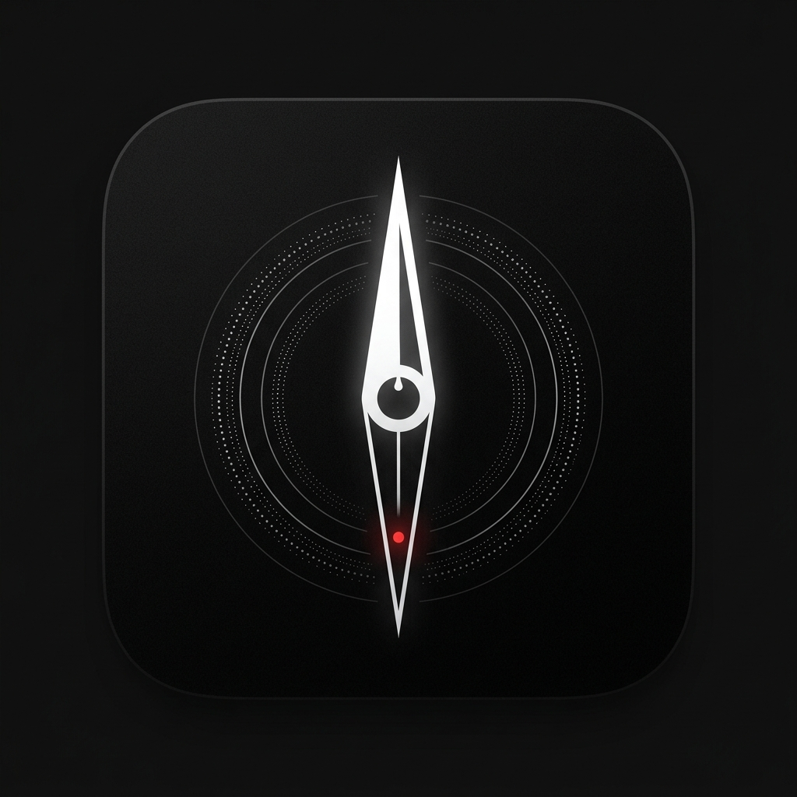

# Drift | Tactical Sensor Suite & Navigation HUD

 
*(Note: A beautiful branding image should go here)*

**Drift** is a cinematic, offline-first Progressive Web Application (PWA) designed to transform modern mobile devices into advanced tactical survival toolkits. It bypasses the limitations of standard browser capabilities by deeply integrating with hardware-level APIs (Magnetometer, Gyroscope, Geolocation, and Haptic Engines) to deliver a premium, physical-feeling navigation experience.

Built by **Aura Labs** as a demonstration of high-fidelity, device-aware web architecture.

---

## 🧭 Core Architecture

Drift is built on a **Zero-Dependency Core Philosophy** (where possible) for mathematical modeling, relying on native APIs to ensure it works deep in the wilderness without cellular service.

- **Offline-First PWA:** Installs natively to Android/iOS home screens. Runs completely offline via Service Workers, instantly serving cached assets and relying solely on hardware GPS and magnetic sensors.
- **Advanced Sensor Fusion:** Uses an intelligent low-pass filter and shortest-path angular interpolation to prevent "needle snapping" and 360-degree wrapping glitches.
- **Tactical Haptics & Sound Engine:** Synthesizes audio using the native `Web Audio API` (no heavy MP3 files) and physical haptic feedback (`navigator.vibrate`) that ticks precisely every 20 degrees of rotation.

## ⚡ Key Features

1. **Precision Compass & Direction Lock**
   - High-fidelity rotating dial with exact azimuth tracking.
   - **Target Lock:** Tap to lock a specific heading. The UI recalculates the delta and visually guides you back to your target bearing.

2. **Waypoint Tracking ("Find My Tent")**
   - Save your exact GPS coordinates completely offline (persisted to LocalStorage).
   - Drift computes the Haversine distance and real-time bearing back to your waypoint, placing a dynamic 3D marker on your compass dial to guide you home.

3. **Sky Navigation & Environment Data**
   - Uses astronomical math to calculate the exact real-time bearing of the **Sun** and **Moon**, projecting them directly onto the compass dial.
   - Fetches dynamic Sunrise/Sunset calculations based on your raw GPS location.

4. **Magnetic Interference & Metal Detection**
   - Monitors raw ambient magnetic flux (µT).
   - If the flux spikes above 85 µT (indicating a strong magnet, speaker, or electronics), the UI triggers a cinematic red pulsing warning to alert you of potential compass inaccuracies.

5. **3D Inclinometer (Bubble Level)**
   - Uses Gyroscopic Pitch (β) and Roll (γ) to render an interactive, physics-based bubble level. 
   - Perfectly calibrated to detect flat surfaces with smooth spring-physics bounds.

6. **Graceful Fallbacks**
   - Deeply respects hardware limitations. If accessed on a device without a magnetometer, the app gracefully degrades, disabling the compass but keeping the Navigation HUD, Flashlight, and Waypoint features fully accessible.

---

## 🛠 Tech Stack

- **Framework:** React 18 + TypeScript + Vite
- **Styling:** TailwindCSS (with extensive use of arbitrary glassmorphism and drop-shadow variables)
- **Animation:** Framer Motion (Spring physics, rotation handling, UI mounting)
- **PWA Management:** `vite-plugin-pwa`
- **Math & Algorithms:** Custom Haversine calculations, Shortest-path interpolation, `suncalc`

## 🚀 Running Locally

1. Install dependencies:
   ```bash
   npm install
   ```
2. Start the development server:
   ```bash
   npm run dev
   ```
   *Note: To test hardware sensors, you must test on a physical mobile device. You can expose your local server using `npm run dev -- --host` and scanning the QR code, provided you access it over HTTPS or Local Area Network.*

## 📦 Deployment

Drift is fully optimized for **Vercel** deployment.
Simply connect the repository and deploy. The Vite PWA plugin will automatically compile the service workers and manifest files for production.

---
*Developed by Aura Labs. For educational and experimental use.*
